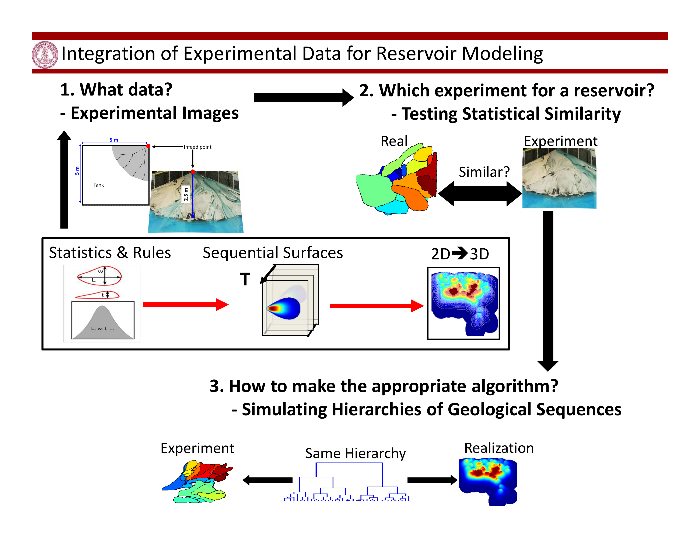

# Stochastic Channel-Lobe Simulator

This repository includes Matlab codes for my phd works. Please see [here](https://github.com/siyaoxu/phd-codes/blob/master/phd-in-4-slides.pdf) for a brief intro to this work and [here](https://github.com/siyaoxu/phd-codes/blob/master/readme.pdf) for the tutorial of the codes.

The repository includes three modules: 
1. A Channel-lobe model simulating stacking patterns of channel-lobe environment; 
2. A data analysis module applying data mining analysis to image sequence taking from two experimental delta. This module also includes an example demonstrating how to compare experiments to real deep water channel-lobe systems; 
3. Another channle-lobe model simulating channle-lobe stacking with inputs using statistics extracted from experimental data.
